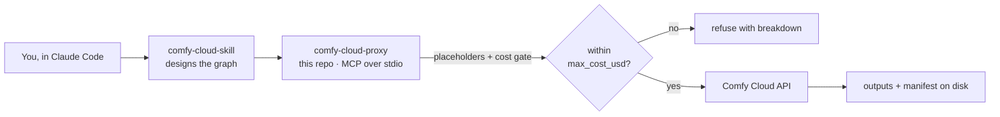

# comfy-cloud-proxy

[](https://github.com/niklazhallberg/comfy-cloud-proxy/actions/workflows/ci.yml)


[](LICENSE)

An MCP server that lets Claude Code **run ComfyUI workflows on [Comfy Cloud](https://cloud.comfy.org)**: upload inputs, submit a graph, track the job, download the outputs, and log what it cost. Every `submit_workflow` call goes through a hard cost check first.

> **New to the terms?** An *MCP server* exposes tools that an AI agent can call. This one gives Claude Code the tools to operate Comfy Cloud. The companion **[comfy-cloud-skill](https://github.com/niklazhallberg/comfy-cloud-skill)** gives Claude the know-how to *design* the workflows. Start there for the full picture and demo.

## How it works



The proxy is deliberately thin. It holds no workflow knowledge, only safe and verifiable access to the Cloud API. Each tool validates its inputs, calls one endpoint, and reads the result back where possible, for example confirming an upload via its content hash or re-parsing a manifest after writing it.

## Tools

| Tool | Purpose |
|---|---|
| `ping` | Connectivity check |
| `get_object_info` | Live node catalog, or the schema for one node. Used to validate graphs before submitting |
| `upload_image` / `upload_mask` | Push local inputs (img2img, inpaint, ControlNet) to Cloud storage |
| `submit_workflow` | Submit any API-format graph. Substitutes `{{PLACEHOLDER}}` tokens, **enforces `max_cost_usd`**, supports `dry_run` |
| `get_job_status` | Job state, outputs, and execution errors |
| `view_output` | Download a result. Follows the storage redirect without leaking the API key |
| `write_manifest` | Write a reproducibility record: workflow, seed, parameters, and cost broken down per node |
| `upload_workflow_to_userdata` / `delete_workflow_from_userdata` | Put a workflow into your Comfy Cloud editor so you can inspect or fine-tune it |
| `submit_simple_txt2img` / `export_simple_txt2img_workflow` | Minimal SD 1.5 smoke test. `submit_simple_txt2img` bypasses the cost gate and has no `dry_run`; use `export_…` to preview it |

## Quick start

Requirements: Node.js 20+ and [Claude Code](https://claude.com/claude-code). A Comfy Cloud API key is only needed for real submissions.

```bash
git clone https://github.com/niklazhallberg/comfy-cloud-proxy.git
cd comfy-cloud-proxy
npm ci && npm run build

claude mcp add comfy-cloud \
  -e COMFY_CLOUD_API_KEY=your-key \
  -- node "$(pwd)/dist/server.js"
```

In Claude Code, ask it to *"ping comfy-cloud"*. It should answer `pong`.

**Try it without an account:** register the server with `-e COMFY_DRY_RUN=true` instead of a key. `submit_workflow` then resolves placeholders and runs the cost gate as usual, and returns the final graph and cost estimate without sending anything.

## Configuration

| Variable | Required | Default | Notes |
|---|---|---|---|
| `COMFY_CLOUD_API_KEY` | For real calls | — | Sent as `X-API-Key`. Also forwarded to Partner Nodes (paid third-party models) unless `partnerNodeAuth: false` |
| `COMFY_CLOUD_BASE_URL` | No | `https://cloud.comfy.org` | |
| `COMFY_DRY_RUN` | No | `false` | Default for `submit_workflow`'s `dry_run` |

Variables can also live in a `.env` file in the project root (see [`.env.example`](.env.example)).

## Design decisions

- **The cost gate is mandatory, not optional.** `max_cost_usd` is a required argument. Partner Nodes (Flux Pro, GPT-Image, Gemini…) cost real money per call. The proxy estimates an upper bound from a price table taken from Cloud's own `/api/object_info`, and refuses to submit over budget. An upper bound was chosen over an exact evaluation of Cloud's price formulas because it is simpler and can only err towards caution.
- **Placeholders instead of generated JSON.** Workflows are stored as templates with `{{NAME}}` tokens. The agent fills in values instead of rewriting the graph, which keeps the graph reviewable and diff-able. Any unresolved token stops the submission.
- **Read-back after every write.** Uploads are checked by hash, and manifests are re-parsed against the expected schema. A tool only reports success after it has confirmed the effect.
- **No credentials leak on redirects.** `/api/view` redirects to storage. The API key is not sent along.
- **Pure logic is separated from I/O.** Placeholder substitution and cost estimation live in [`src/workflow.ts`](src/workflow.ts) and are unit-tested. Everything else is thin endpoint wrappers in [`src/server.ts`](src/server.ts).

## Scope & limitations

- **Out of scope:** multi-user auth, a job queue or rate limiting, caching, and self-hosted ComfyUI. The proxy is a single-user, local stdio server.
- **Cost estimates are upper bounds.** GPU time is a rough baseline. Actual billing comes from Comfy Cloud. The price table needs manual updates when Partner Node pricing changes.
- **Outputs are non-deterministic** across model versions, even with a fixed seed. `write_manifest` records what is needed to get as close as possible.
- Built and tested with Claude Code. Other MCP clients should work, but are untested.

## Development

```bash
npm run dev        # run from source with tsx
npm run typecheck
npm test           # node:test, no network
npm run build
```

## Troubleshooting

| Symptom | Cause / fix |
|---|---|
| `Missing COMFY_CLOUD_API_KEY` | Key not passed to the server. Use `claude mcp add -e …` or a `.env` in the project root |
| `Cost gate refusal: estimated total …` | Working as intended. Raise `max_cost_usd` deliberately, or swap the Partner Node |
| `Workflow contains unresolved placeholders` | Add the missing names to `inputs` |
| 404 on `upload_workflow_to_userdata` into a subfolder | Cloud doesn't create folders on upload. Use the root, or save once from the editor first |

## Related

- **[comfy-cloud-skill](https://github.com/niklazhallberg/comfy-cloud-skill)**: the companion skill (pipeline design, validation rules, phases)
- [Comfy Cloud](https://cloud.comfy.org) · [ComfyUI](https://github.com/comfyanonymous/ComfyUI) · [Model Context Protocol](https://modelcontextprotocol.io)

See [CHANGELOG.md](CHANGELOG.md) for version history.

## License & contact

[MIT](LICENSE) © Niklaz Hallberg · [niklaz.a.hallberg@gmail.com](mailto:niklaz.a.hallberg@gmail.com)
